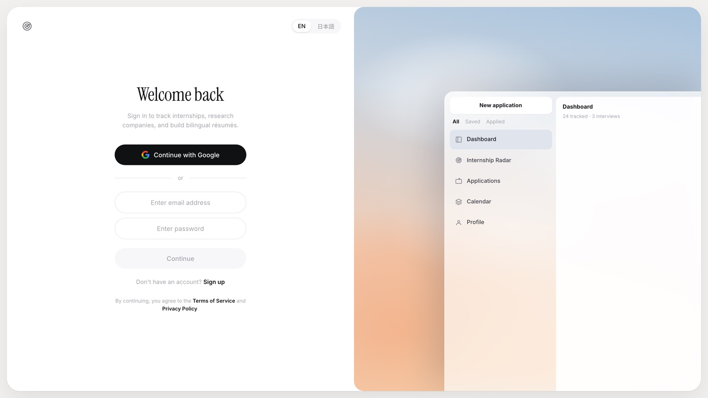

<div align="center">

# Internship Portal

**A bilingual (EN / 日本語) app for finding internships and keeping every application in one list, on the web and on iOS.**

[](https://portal.mohamedfuad.com)
[](https://react.dev/)
[](https://developer.apple.com/swiftui/)
[](https://expressjs.com/)
[](#deployment)
[](https://firebase.google.com/)



</div>

---

## Overview

Search internships with a match score for each, and track every application in
one list until a decision. The same repository ships a React web app and a
SwiftUI iOS app, both in English and Japanese. Your own data stays in Firestore
under owner-only rules and never reaches the server.

**Live:** <https://portal.mohamedfuad.com>

| Surface | Tree | Branch | What it is |
|---|---|---|---|
| **Web app** | `editor/` | `web` | React SPA: internship radar, application tracker, calendar, company research, résumé upload |
| **iOS app** | `ios/` | `ios` | SwiftUI (iOS 27): radar, applications, calendar, companies, Gmail sync and notifications |
| **Shared contracts** | `contracts/` | both | The API routes, data shapes and algorithms both clients depend on |
| **LaTeX résumés** | `en/`, `ja/`, `build_all.sh` | `web` | Standalone print-ready résumé sources compiled to `output/*.pdf` |

Branches integrate through `main`. The rules both surfaces follow are in
[`CLAUDE.md`](CLAUDE.md); the knowledge bases are [`agent/web/`](agent/web/agent.md)
and [`agent/ios/`](agent/ios/agent.md).

## Features

**Both clients**
- **Internship radar**: every posting in the shared catalog is scored against
  your profile.
- **Application tracker**: saved, applying, applied, interview and rejected, all
  in one list, with a calendar of deadlines and interviews.
- **Gmail ingest**: the server reads the inbox and queues an application only
  when a quote from the email proves it. Each client drains the queue into its
  own Firestore tracker.
- **Company research**: live research over official company and ATS pages.
- **English and Japanese** throughout, with company logos.

**Web only**
- **Résumé upload**: a PDF is parsed in the browser into the résumé JSON and is
  never sent to the server or stored.
- **Activity period filter** on the dashboard and applications views.
- **Pause automatic Gmail scans** per profile; a manual scan always runs.

**iOS only**
- Metal-shaded glass UI and a Companies bubble field.
- Background app refresh that syncs Gmail and posts a notification with the
  company logo when a new application is detected.

## Architecture

User data never touches the server. Clients talk to Firestore directly under
owner-only rules; the server owns only shared data (the internship catalog and
the Gmail action queue).

```
┌──────────────────────┐          ┌──────────────────────┐
│  Web (React SPA)     │          │  iOS (SwiftUI)       │
│  static on Vercel    │          │  on device           │
└──────────┬───────────┘          └──────────┬───────────┘
           │                                 │
           │  user data (client-direct)      │
           ▼                                 ▼
     ┌───────────────────────────────────────────────┐
     │  Firebase Auth  +  Firestore                  │
     │  users/{uid}/**, owner-only rules             │
     │  the server cannot read it                    │
     └───────────────────────────────────────────────┘
           │                                 │
           │  shared data + compute          │
           ▼                                 ▼
     ┌───────────────────────────────────────────────┐
     │  Express server, Docker on AWS EC2 (Tokyo)    │
     │  https://api.mohamedfuad.com                  │
     │    ├─ /api/internships   shared catalog       │
     │    ├─ /api/integrations/gmail/*  ingest queue │
     │    ├─ company research jobs (OpenRouter)      │
     │    └─ storage.js  SQLite working copy         │
     │             └─ snapshot → /data               │
     └───────────────────────────────────────────────┘
```

**Vercel hosts static files only.** The web client calls the API origin
directly through `VITE_API_BASE_URL`; iOS reads the same origin from
`PortalAPIBaseURL` in `ios/project.yml`. The routes both clients depend on are
listed in [`contracts/api.md`](contracts/api.md).

### Storage

SQLite runs on a local working copy, and after each write the whole finished
file is copied to the durable `/data` path (ADR-0040). The design came from an
earlier Azure Files mount, where SQLite cannot take file locks over SMB; the
server now runs on EC2 and keeps the same two-tier store.

### Gmail ingest

The server reads the inbox, classifies each message, and **queues** actions; the
clients drain that queue into their own Firestore tracker (the server can't).
Internship detection is based on evidence, never on a company list: the model
must quote the email's own words, and the quote is checked against the message.
Contract: [`contracts/gmail-action.md`](contracts/gmail-action.md).

## Tech Stack

| Layer | Technology |
| ----- | ---------- |
| Web client | React 18, Vite, GSAP, hand-written CSS |
| iOS client | SwiftUI (iOS 27), Swift 6, Metal, XcodeGen |
| Server | Node.js / Express (ESM), Docker on AWS EC2 behind Caddy |
| Auth + user data | Firebase Auth, Firestore (client-direct, owner-only rules) |
| Shared data | SQLite (`better-sqlite3`), local working copy snapshotted to `/data` |
| LLM | OpenRouter: `gpt-5-nano` (mail triage), `perplexity/sonar` (company research) |
| Résumé PDFs | Tectonic (XeLaTeX) for the standalone `en/` and `ja/` sources |
| Testing | Playwright (web), Node test runner, PyMuPDF (PDFs), `validate:catalog` |
| Hosting | Vercel (static SPA), AWS EC2 (API) |

## Getting Started

### Web app

```bash
cd editor
npm install
npm run dev          # client on http://127.0.0.1:5173, API on :5005
```

`npm run dev` starts the Vite client and the Express server together, and Vite
proxies `/api` to `http://localhost:5005`. The server reads `editor/.env.local`
or `editor/.env`; the OpenRouter and Gmail features need `OPENROUTER_API_KEY`,
`GOOGLE_CLIENT_ID`, `GOOGLE_CLIENT_SECRET`, `GOOGLE_OAUTH_REDIRECT_URI` and
`GMAIL_TOKEN_ENC_KEY`.

Other scripts in `editor/`:

```bash
npm run build              # production build
npm run lint               # ESLint over src and server
npm run test:e2e           # Playwright
npm run test:classify      # Gmail classifier tests
npm run validate:catalog   # catalog data and storage checks
```

`scripts/verify-web.sh` runs the full web verification battery.

### iOS app

```bash
cd ios
xcodegen generate    # regenerate after adding/removing any file
open InternshipPortal.xcodeproj
```

Requires Xcode 27 (iOS 27 SDK). Signing must stay **on** even for the simulator,
because Firebase Auth needs a keychain entitlement. See
[`agent/ios/setup.md`](agent/ios/setup.md).

### LaTeX résumés

```bash
./build_all.sh              # en/ + ja/ → output/*.pdf
python3 tests/run_tests.py  # validate the compiled PDFs
```

`build_all.sh` expects Tectonic at `/opt/homebrew/bin/tectonic`; edit the
`TECTONIC` line if yours lives elsewhere.

## Deployment

**Web client (Vercel):** static only; pushing to `main` deploys it. The API
origin is baked in at build time through `VITE_API_BASE_URL`.

**Server (AWS EC2):** the root `Dockerfile` builds the API image for
`linux/amd64`. Production runs it as a Docker container on an EC2 host in Tokyo
behind Caddy, at `https://api.mohamedfuad.com`, with data under `/data`.
Deploys are manual; a push does not update the server. After a deploy, check a
**write** path (`POST /api/integrations/gmail/sync-now` returns 200), not just a
read, because a storage regression shows up only on writes.

## Repository Layout

```
editor/          # Web app: React SPA + Express server
ios/             # iOS app: SwiftUI
contracts/       # Shared API/data/algorithm contracts (both clients)
agent/web/       # Web knowledge base (architecture, api, decisions, state)
agent/ios/       # iOS knowledge base
en/  ja/         # LaTeX résumé sources
build_all.sh     # Compile all LaTeX templates → output/
tests/           # PyMuPDF PDF validation suite
docs/            # Deployment and compile notes, screenshots
scripts/         # verify-web.sh, verify-ios.sh
CLAUDE.md        # Working rules for both surfaces
DOCTOR.md        # Operating prompt for the code-review account
```

## Quality

A third **code-doctor** account audits the repo on a schedule and files findings
as `doctor/*` pull requests: React and iOS lint passes, dead-code sweeps, and
contract-conformance diffing between the two clients' implementations of the
shared algorithms. See [`DOCTOR.md`](DOCTOR.md).

---

<div align="center">
Built by <a href="https://github.com/MohamedFuad16">Mohamed Fuad</a> · <a href="https://www.mohamedfuad.com">mohamedfuad.com</a>
</div>
