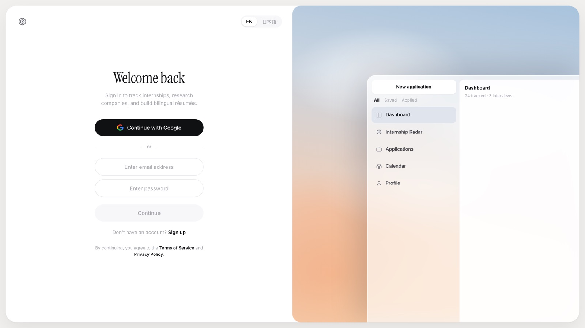

<div align="center">

# Internship Portal

**A bilingual (EN / 日本語) web app for finding internships and new-graduate jobs in Japan and keeping every application in one place.**

[](https://portal.mohamedfuad.com)
[](https://react.dev/)
[](https://expressjs.com/)
[](#deployment)
[](https://firebase.google.com/)



</div>

---

## Overview

Internship Portal collects internship, new-graduate and junior roles in Japan
into one searchable list, and tracks each application from the first email to
the final decision. It works in English and Japanese.

**Live:** <https://portal.mohamedfuad.com>

The project is web-only for now. An earlier SwiftUI iOS client is paused and
will return once the web rebuild below is finished.

## Rebuild in progress

The app is being rebuilt so it is fast and useful for any job seeker in Japan,
not only its author. Gmail sync and live company research are switched off in
production until the new versions land. The plan, with its phases and checks,
is in [`docs/rebuild-plan.md`](docs/rebuild-plan.md). Coming in the rebuild:

- One job index built from the major Japanese job sites and company career
  pages, refreshed by a background worker.
- Plain-language search in the internship radar, for example "internships in
  AI engineering with no experience required".
- Company pages that show the selection process step by step, with the next
  step added to your calendar.
- Several Gmail accounts linked to one profile, with applications split into
  internship, new graduate and full time.
- A résumé or cover letter tailored to each role, in English or Japanese,
  editable before you download the PDF.

## Features today

- **Internship radar**: every posting in the catalog, scored against your
  profile, with filters for region, track, language and deadline.
- **Application tracker**: saved, applying, applied, interview and rejected in
  one list, with a calendar of deadlines and interviews.
- **Activity period filter** on the dashboard and applications views.
- **Résumé upload**: a PDF is parsed in the browser into your profile; the file
  itself is never stored.
- **English and Japanese** throughout, with company logos.

## Architecture today

```
┌──────────────────────┐
│  Web (React SPA)     │  static files on Vercel
└──────────┬───────────┘
           │ user data (client-direct)
           ▼
┌───────────────────────────────────────────────┐
│  Firebase Auth  +  Firestore                  │
│  users/{uid}/**, owner-only rules             │
└───────────────────────────────────────────────┘
           │ shared data and compute
           ▼
┌───────────────────────────────────────────────┐
│  Express server, Docker on AWS EC2 (Tokyo)    │
│  https://api.mohamedfuad.com                  │
│    ├─ /api/internships   shared catalog       │
│    ├─ /api/integrations/gmail/*  (paused)     │
│    └─ storage.js  SQLite working copy         │
│             └─ snapshot → /data               │
└───────────────────────────────────────────────┘
```

Vercel hosts static files only; the client calls the API origin directly
through `VITE_API_BASE_URL`. In the rebuild, Firebase handles sign-in only and
all user data moves to the database on the EC2 host, so the dashboard loads
with one request.

## Tech stack

| Layer | Technology |
| ----- | ---------- |
| Web client | React 18, Vite, GSAP, hand-written CSS |
| Server | Node.js / Express (ESM), Docker on AWS EC2 behind Caddy |
| Auth | Firebase Auth |
| Data | Firestore for user data today; SQLite (`better-sqlite3`) on the server |
| LLM | OpenRouter |
| Testing | Playwright, Node test runner, `validate:catalog` |
| Hosting | Vercel (static SPA), AWS EC2 (API) |

## Getting started

```bash
cd editor
npm install
npm run dev          # client on http://127.0.0.1:5173, API on :5005
```

`npm run dev` starts the Vite client and the Express server together, and Vite
proxies `/api` to `http://localhost:5005`. The server reads `editor/.env.local`
or `editor/.env`; the OpenRouter and Gmail features need `OPENROUTER_API_KEY`,
`GOOGLE_CLIENT_ID`, `GOOGLE_CLIENT_SECRET`, `GOOGLE_OAUTH_REDIRECT_URI` and
`GMAIL_TOKEN_ENC_KEY`.

Other scripts in `editor/`:

```bash
npm run build              # production build
npm run lint               # ESLint over src and server
npm run test:e2e           # Playwright
npm run test:classify      # Gmail classifier tests
npm run validate:catalog   # catalog data and storage checks
```

`scripts/verify-web.sh` runs the full verification battery.

## Deployment

**Web client (Vercel):** static only; pushing to `main` deploys it. The API
origin is baked in at build time through `VITE_API_BASE_URL`.

**Server (AWS EC2):** the root `Dockerfile` builds the API image for
`linux/amd64`. Production runs it as a Docker container on an EC2 host in Tokyo
behind Caddy, at `https://api.mohamedfuad.com`, with data under `/data`.
Deploys are manual; a push does not update the server. After a deploy, check a
write path as well as a read, because a storage regression shows up only on
writes.

## Repository layout

```
editor/          # Web app: React SPA (src/) + Express server (server/)
agent/           # Knowledge base: architecture, api, decisions, state
docs/            # Rebuild plan, screenshots
scripts/         # verify-web.sh
CLAUDE.md        # Working rules
DOCTOR.md        # Operating prompt for the code-review account
```

## Quality

A separate code-doctor account audits the repo on a schedule and files findings
as `doctor/*` pull requests: lint and react-doctor passes, dead-code sweeps,
and data-integrity checks on authentication and the Gmail classifier. See
[`DOCTOR.md`](DOCTOR.md).

---

<div align="center">
Built by <a href="https://github.com/MohamedFuad16">Mohamed Fuad</a> · <a href="https://www.mohamedfuad.com">mohamedfuad.com</a>
</div>
